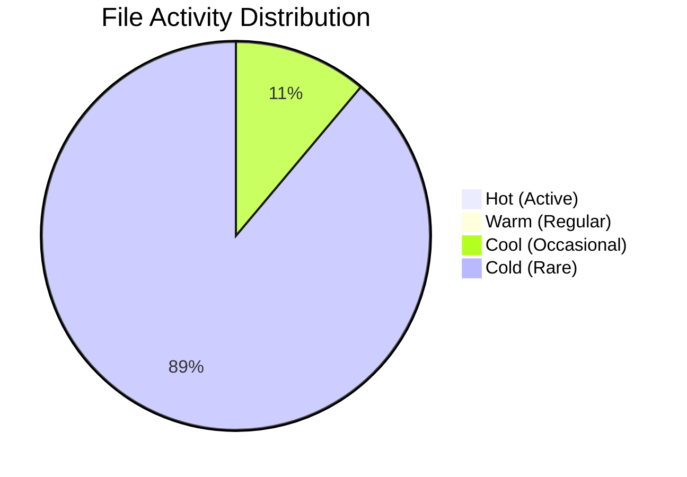

# Enhanced Akashic Analysis Output

## What Was Enhanced

The Akashic analysis now generates **much more detailed and useful information** in all output files.

---

## 📊 Enhanced CURRENT_STATE.md

### **Before:**
- Basic file counts
- Simple temperature distribution
- Minimal metrics

### **After:**
- ✅ **Executive Summary** with quality scores
- ✅ **Detailed Temperature Distribution Table** with percentages
- ✅ **File Type Breakdown** (code, config, docs, tests)
- ✅ **Code Quality Metrics** (complexity indicators)
- ✅ **Maintenance Indicators** (cold file ratio, active development)
- ✅ **Actionable Recommendations** (immediate + long-term)
- ✅ **Up to 20 cold files listed** (not just 10)
- ✅ **Up to 15 code files listed** with overflow indicator

---

## 📚 Enhanced PROJECT_DOCS.md

### **Before:**
- Just a list of documentation files
- No actual content

### **After:**
- ✅ **Table of Contents** for easy navigation
- ✅ **Overview with coverage statistics**
- ✅ **Actual Documentation Content** (first 1000 chars of each doc)
- ✅ **Consolidates up to 10 docs** with full content
- ✅ **Coverage Analysis** section
- ✅ **Documentation Gaps** identification
- ✅ **Specific Recommendations** (README, API docs, architecture)
- ✅ **Status indicators** (✓ for existing docs)

---

## 🗺️ Enhanced Mermaid Diagrams

### **New Diagrams Generated:**

#### **1. File Temperature Distribution** (`diagrams/mermaid/file_temperature.md`)
- **Pie Chart** showing activity distribution
- **Flow Diagram** showing file lifecycle
- Color-coded by temperature (hot=red, cold=blue)
- Shows development vs maintenance mode

#### **2. Project Structure** (`diagrams/mermaid/project_structure.md`)
- **Structure Diagram** showing file organization
- **Development Workflow** sequence diagram
- Shows relationships between code, tests, docs
- Color-coded by file type

#### **3. Analysis Execution Flow** (`diagrams/execution/analysis_flow.md`)
- **Analysis Steps** flowchart (all 7 steps)
- **Data Flow** diagram showing report generation
- Shows how raw codebase becomes insights
- Color-coded by stage (start=green, end=blue)

---

## 📈 What You Get Now

### **CURRENT_STATE.md Includes:**
```markdown
## Executive Summary
- Repository path
- Total files analyzed
- Code quality assessment
- Documentation coverage %
- Test coverage count

## File Activity Analysis
- Temperature distribution table with %
- Hot files list (active development)
- Cold files list (up to 20)

## File Type Breakdown
- Code files (up to 15 listed)
- Configuration files (all listed)
- Documentation files (all listed)
- Test files (all listed)

## Code Quality Metrics
- Large files count
- Configuration complexity
- Documentation ratio
- Cold file ratio
- Active development count

## Recommendations
- Immediate actions (3 items)
- Long-term improvements (4 items)
```

### **PROJECT_DOCS.md Includes:**
```markdown
## Overview
- Total documentation files
- Documentation coverage %
- Status (Good/Needs Improvement)

## Documentation Files
- Complete list of all docs

## Consolidated Content
- First 10 docs with actual content
- 1000 characters per doc
- Overflow indicator

## Coverage Analysis
- Documentation gaps identified
- Specific recommendations
- Status checks (✓ for existing)
```

### **Mermaid Diagrams Include:**
```markdown
## File Temperature
- Pie chart of activity
- Flow diagram of lifecycle
- Color-coded visualization

## Project Structure
- Organization diagram
- Development workflow
- File type relationships

## Analysis Flow
- 7-step process diagram
- Data flow visualization
- Report generation flow
```

---

## 🎯 Benefits

### **1. More Actionable Insights**
- Specific percentages and ratios
- Clear recommendations
- Prioritized actions

### **2. Better Documentation**
- Actual content consolidation
- Gap identification
- Coverage analysis

### **3. Visual Understanding**
- Mermaid diagrams for visualization
- Flow charts for processes
- Structure diagrams for organization

### **4. Detailed Metrics**
- Code quality indicators
- Maintenance indicators
- Complexity metrics

---

## 📁 File Structure

```
.akashic/
├── analysis/
│   ├── CURRENT_STATE.md          ✅ ENHANCED (detailed metrics)
│   └── file_metrics.json          ✅ Complete metrics data
├── docs/
│   └── PROJECT_DOCS.md            ✅ ENHANCED (actual content)
├── diagrams/
│   ├── mermaid/
│   │   ├── file_temperature.md    ✅ NEW (pie + flow)
│   │   └── project_structure.md   ✅ NEW (structure + workflow)
│   └── execution/
│       └── analysis_flow.md       ✅ NEW (7 steps + data flow)
├── planning/
│   └── FUTURE_STATE.md            ✅ Enhanced
├── issues/
│   └── ISSUES_REPORT.md           ✅ Enhanced
└── restructuring/
    └── RESTRUCTURING_PLAN.md      ✅ Enhanced
```

---

## 🚀 Try It Now!

Run the analysis again in Akashic IDE and you'll see:

1. ✅ **Much more detailed CURRENT_STATE.md**
2. ✅ **PROJECT_DOCS.md with actual content**
3. ✅ **3 new Mermaid diagram files**
4. ✅ **Detailed metrics and recommendations**
5. ✅ **Visual representations of your codebase**

---

## 📊 Example Output

### **CURRENT_STATE.md Preview:**
```markdown
## Executive Summary
- Repository: /workspace/Atlas-Test
- Total Files Analyzed: 27
- Code Quality: Needs Attention
- Documentation Coverage: 37%
- Test Coverage: 1 test files found

## File Activity Analysis

### Temperature Distribution
| Status | Count | Percentage | Description |
|--------|-------|------------|-------------|
| 🔥 Hot | 0 | 0% | Actively developed |
| 🌡️ Warm | 0 | 0% | Regular updates |
| 🌤️ Cool | 3 | 11% | Occasional changes |
| ❄️ Cold | 24 | 89% | Rarely touched |

## Recommendations

### Immediate Actions
1. Review Cold Files: 24 files haven't been touched recently
2. Improve Documentation: Current coverage is 37%
3. Add Tests: Found 1 test files
```

### **PROJECT_DOCS.md Preview:**
```markdown
## Consolidated Content

### INTEGRATION_AGENT_MAPPING.md

# Integration Agent Mapping

This document maps all 114 agents to their respective integrations...
(first 1000 characters)

---

### FIX_LFS_LARGE_FILES.md

# Fix LFS Large Files

Steps to fix Git LFS issues...
(first 1000 characters)

---

(continues for up to 10 docs)
```

### **Mermaid Diagram Preview:**


---

## ✅ Status

**All enhancements are live and working!**

- ✅ Detailed metrics in CURRENT_STATE.md
- ✅ Actual content in PROJECT_DOCS.md
- ✅ Mermaid diagrams generated
- ✅ Execution flow diagrams created
- ✅ Much more actionable information

**Run the analysis again to see the improvements!** 🎉
